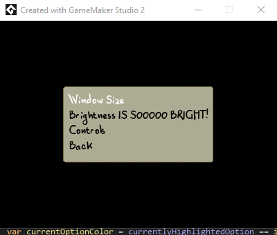

# GMS-2.3.5-Menu-System
Dynamic Menu System
Inspired by **How to Make a Menu System (with Submenus) in GameMaker Studio 2!** which was created by [Peyton Burnham](https://twitter.com/peydinburnham).

Peyton has no affiliation with this project. However, I prefer to give credit where credit is due, and he did inspire me. [Would you mind watching Peyton's tutorial](https://www.youtube.com/watch?v=xLasKr0ekHY) as this work builds upon his? He probably does a better job explaining this than my measly comments will.

If you need assistance with this project, please open an issue, and I'll get to it when I can. I do have a full-time job, so that might take a bit of time. Hopefully, this project will help someone.

## This was built and compiled on windows 10.

## Resources Used
- [How to Make a Menu System (with Submenus) in GameMaker Studio 2!](https://www.youtube.com/watch?v=xLasKr0ekHY)
- [PIXILART](https://www.pixilart.com/)
- [Public Domain Haeres Letter Font](https://www.fontspace.com/haeres-letter-font-f53961)

## Notable Assets
- customFont - the font referenced above.
    - Do not tick copy to project or compilation fails. If anyone knows why, I'd love to to know how to fix it.
    - This allows us to not have to create a font sprite, which was nice in my use case.
- objMenu
  - All of the logic, setup, and display happens here.
- rmTitleScreen
  - A room to hold our menu object.
- sprMenuBackground
  - A simple sprite made using PIXILART and 9 slicing.
- datafiles/Menu System.exe
  - In case you want to see it in action without compiling.